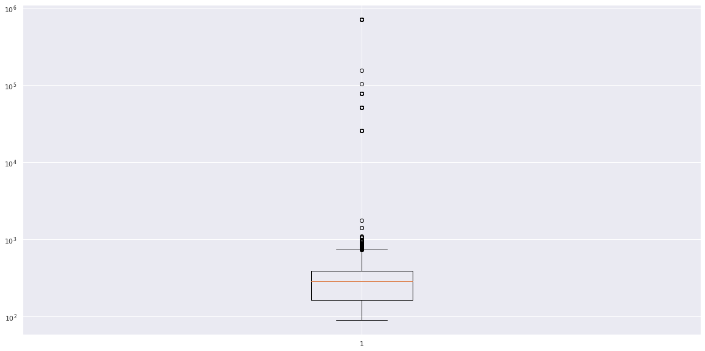

## Shopify Data Science Internship Challenge Summer 2022

This is my submission with my analysis included, for the Shopify data science challenge.

### Question 1
My approach to this question was to perform an exporatory data analysis on the dataset provided to better understand its features and the issue with the AOV calculation provided in the question. My work was done on a Jupyter Notebook on Google Colab: [Shopify 2022 Summer Challenge](https://colab.research.google.com/drive/16BDvMPM5h5sTrEkixBL8F8hhzO_wKS7M?usp=sharing).

```python

"""
This notebook preforms an analysis of the data on shoe orders from 100 Shopify stores.
The purpose is to explore any trends and distributions within the data.
--------------------------
Author: Palvisha Sharma 
"""
```
```python
# import libraries
# since I am working on google colab, lines 7 and 8 refer to the 
# drive being mounted so that I can work with the sample data 

# import libraries
# since I am working on google colab, lines 7 and 8 refer to the 
# drive being mounted so that I can work with the sample data 

import pandas as pd
import matplotlib.pyplot as plt
import seaborn as sns 
import statistics
import numpy as np
from google.colab import drive
from google.colab import files
drive.mount("/content/drive")
sns.set()

```
```python
# importing and printing the data header

df = pd.read_csv("/content/drive/My Drive/Colab Notebooks/data/ShopifyChallengeData.csv")
print(df.head())

  order_id  shop_id  user_id  ...  total_items  payment_method           created_at
0         1       53      746  ...            2            cash  2017-03-13 12:36:56
1         2       92      925  ...            1            cash  2017-03-03 17:38:52
2         3       44      861  ...            1            cash   2017-03-14 4:23:56
3         4       18      935  ...            1     credit_card  2017-03-26 12:43:37
4         5       18      883  ...            1     credit_card   2017-03-01 4:35:11

[5 rows x 7 columns]
```
```python
# ensure that there are no null values in the data set
df.isnull().sum()

order_id          0
shop_id           0
user_id           0
order_amount      0
total_items       0
payment_method    0
created_at        0
dtype: int64
```
```python
# determining the columns in the data
df.columns

Index(['order_id', 'shop_id', 'user_id', 'order_amount', 'total_items',
       'payment_method', 'created_at'],
      dtype='object')
```
```python
# determining the shape of our data, this can be used to determine the 
# number of features and amount of data 
df.shape

(5000, 7)

# since the point of focus is the order amount, I will preform an analysis of the data below
print(df["order_amount"])

0       224
1        90
2       144
3       156
4       156
       ... 
4995    330
4996    234
4997    351
4998    354
4999    288
Name: order_amount, Length: 5000, dtype: int64

```
```python
# maximum value in the data set 
df["order_amount"].max()

704000

# minimum value in the data set
df["order_amount"].min()

90

# mean of the order_amount 
df["order_amount"].mean()

3145.128

# median of the order_amount
df["order_amount"].median()

284.0

# mode of the order_amount
df["order_amount"].mode()

0    153
dtype: int64

# standard deviation of my data 
df["order_amount"].std()

41282.539348788196


```
Looking at the maxiumum and minimum amounts, the maximum amount is unreasonably high (definitely a lot closer to house prices in toronto than a shoe). Extreme data points such as this, skew the mean of the data, which is why the average is much higher than expected.

The standard deviation of my data is very high, suggesting that most data points do not agree with the AOV. This confirms that the mean is not an appropriate metric for the AOV.

```python
# I can represent the data points relative to the median through a box plot
# to get a better understanding of the general data that I have, and any outliers

plt.figure(figsize=(20,10))
plt.yscale("log")
plt.boxplot(df["order_amount"])
plt.show()



```
```python
```
```python
```
```python
```
```python
```
```python
```
```python
```

a. The AOV amount provided in the question is $3145.13. The AOV is calculated by taking the total revenue and dividing by the total number of orders. The reason that this  AOV calculation is much higher than the expected cost of shoes is because the average does not represent the central tendency of the data. As well, given that the highest order total is $704 000 (definitely closer to being the price of a house than a shoe), and because there are multiple orders of this total value, the AOV is highly skewed due to these data points. This maximum order amount greatly offsets the AOV from the cost of individual shoes.

Since the AOV is highly skewed by such data points, it is not an accurate representation of the general cost of shoes amongst the 100 stores. Due to this, it also does not provide much information about the stores and shoe purchases aside from the average amount of money spent on shoes over this particular 30 day period. For substantial information on the dataset and associated costs, rather than the AOV, the average or median cost (if there is a highly skewed distribution) of shoes must be reported.  

## EDA


```markdown
Syntax highlighted code block

# Header 1
## Header 2
### Header 3

- Bulleted
- List

1. Numbered
2. List

**Bold** and _Italic_ and `Code` text

[Link](url) and 
```

For more details see [Basic writing and formatting syntax](https://docs.github.com/en/github/writing-on-github/getting-started-with-writing-and-formatting-on-github/basic-writing-and-formatting-syntax).

### Jekyll Themes

Your Pages site will use the layout and styles from the Jekyll theme you have selected in your [repository settings](https://github.com/palvisha13/ShopifyDataSciChallenge/settings/pages). The name of this theme is saved in the Jekyll `_config.yml` configuration file.

### Support or Contact

Having trouble with Pages? Check out our [documentation](https://docs.github.com/categories/github-pages-basics/) or [contact support](https://support.github.com/contact) and we’ll help you sort it out.
